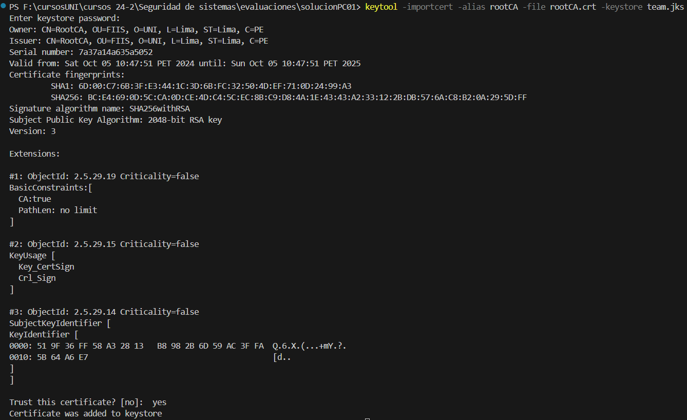

# Firma de certificado por una CA (Certificación jerárquica)
## a. Crear una Entidad Certificadora (EC).
Genere un Certificado Autofirmado. Este vendría a ser el Certificado Raíz de la EC.

<h3 style="color: #295F98">Solución:</h3> 

1. Genera el certificado autofirmado para la EC
    ```shell
    keytool -genkeypair -alias rootCA -validity 365 -keystore rootCA.jks -keyalg RSA -keysize 2048 -dname "CN=RootCA, OU=FIIS, O=UNI, L=Lima, ST=Lima, C=PE" -ext bc=ca:true -ext ku=keyCertSign,cRLSign
    ```
    - `-ext bc=ca:true`: Especifica que es un certificado de autoridad (CA).
    - `-ext ku=keyCertSign,cRLSign`: El uso de clave (KeyUsage) permite firmar certificados (`keyCertSign`) y listas de revocación de certificados (`cRLSign`).

    > 💡 **root KS pss:** root123.

    

2. Exportar el certificado de la CA raiz

    ```shell
    keytool -exportcert -alias rootCA -keystore rootCA.jks -file rootCA.crt -storepass root123
    ```

## b. Cree un certificado digital para cada uno de los integrantes de su grupo firmado la EC.

<h3 style="color: #295F98">Solución:</h3> 

1. **Genera una clave y certificado autofirmado para cada integrante**

    * Creación de certificado para **Andres Salazar**

    ```shell
    keytool -genkeypair -alias AndresSalazar -validity 365 -keystore team.jks -keyalg RSA -keysize 2048 -dname "CN=Andres Salazar, OU=FIIS, O=UNI, L=Lima, ST=Lima, C=PE"

    ```
    * Creación de certificado para **Jhan Antezana**

    ```shell
    keytool -genkeypair -alias JhanAntezana -validity 365 -keystore team.jks -keyalg RSA -keysize 2048 -dname "CN=Jhan Antezana, OU=FIIS, O=UNI, L=Lima, ST=Lima, C=PE"

    ```
    * Creación de certificado para **Angelo Vidal**

    ```shell
    keytool -genkeypair -alias AngeloVidal -validity 365 -keystore team.jks -keyalg RSA -keysize 2048 -dname "CN=Angelo Vidal, OU=FIIS, O=UNI, L=Lima, ST=Lima, C=PE"

    ```
    * Creación de certificado para **Iori Villegas**

    ```shell
    keytool -genkeypair -alias IoriVillegas -validity 365 -keystore team.jks -keyalg RSA -keysize 2048 -dname "CN=Iori Villegas, OU=FIIS, O=UNI, L=Lima, ST=Lima, C=PE"

    ```
    > 💡 **team KS pss:** team123.

    

2. **Genera una solicitud de firma de certificado (CSR) para cada**

    * Generar una CSR para **Andres Salazar**
    ```shell
    keytool -certreq -alias AndresSalazar -keystore team.jks -file Salazar.csr

    ```
    * Generar una CSR para **Jhan Antezana**
    ```shell
    keytool -certreq -alias JhanAntezana -keystore team.jks -file Antezana.csr

    ```
    * Generar una CSR para **Angelo Vidal**
    ```shell
    keytool -certreq -alias AngeloVidal -keystore team.jks -file Vidal.csr

    ```
    * Generar una CSR para **Iori Villegas**
    ```shell
    keytool -certreq -alias IoriVillegas -keystore team.jks -file Villegas.csr

    ```
    

3. **Firma la solicitud con la EC**

    * Firmar certificado de **Andres Salazar**
    ```shell
    keytool -gencert -alias rootCA -keystore rootCA.jks -infile Salazar.csr -outfile Salazar_signed.crt -validity 365 -ext ku=digitalSignature,keyEncipherment -ext eku=serverAuth,clientAuth
    
    ```
    * Firmar certificado de **Jhan Antezana**
    ```shell
    keytool -gencert -alias rootCA -keystore rootCA.jks -infile Antezana.csr -outfile Antezana_signed.crt -validity 365 -ext ku=digitalSignature,keyEncipherment -ext eku=serverAuth,clientAuth
    
    ```
    * Firmar certificado de **Angelo Vidal**
    ```shell
    keytool -gencert -alias rootCA -keystore rootCA.jks -infile Vidal.csr -outfile Vidal_signed.crt -validity 365 -ext ku=digitalSignature,keyEncipherment -ext eku=serverAuth,clientAuth
    
    ```
    * Firmar certificado de **Iori Villegas**
    ```shell
    keytool -gencert -alias rootCA -keystore rootCA.jks -infile Villegas.csr -outfile Villegas_signed.crt -validity 365 -ext ku=digitalSignature,keyEncipherment -ext eku=serverAuth,clientAuth
    
    ```
   
4. **Importar Certificados**

    4.1. Importa el certificado de la EC en el almacén de claves del grupo

    ```shell
    keytool -importcert -alias rootCA -file rootCA.crt -keystore team.jks
    ```
    

    4.1. Importa el certificado firmado por la EC de cada integrante en el almacén de claves del grupo

    * Importar certificado firmado de **Andres Salazar**

    ```shell
    keytool -importcert -alias AndresSalazar -file Salazar_signed.crt -keystore team.jks    
    ```
    * Importar certificado firmado de **Jhan Antezana**

    ```shell
    keytool -importcert -alias JhanAntezana -file Antezana_signed.crt -keystore team.jks    
    ```
    * Importar certificado firmado de **Angelo Vidal**

    ```shell
    keytool -importcert -alias AngeloVidal -file Vidal_signed.crt -keystore team.jks    
    ```
    * Importar certificado firmado de **Iori Villegas**

    ```shell
    keytool -importcert -alias IoriVillegas -file Villegas_signed.crt -keystore team.jks    
    ```
    

5. Exportar certificado del los integrantes del equipo como `.p12`

    * Exportar certificado de **Andres Salazar**
    ```shell
    keytool -importkeystore -srckeystore team.jks -destkeystore Salazar.p12 -deststoretype PKCS12 -srcalias AndresSalazar
    ```
    * Exportar certificado de **Jhan Antezana**
    ```shell
    keytool -importkeystore -srckeystore team.jks -destkeystore Antezana.p12 -deststoretype PKCS12 -srcalias JhanAntezana
    ```
    * Exportar certificado de **Angelo Vidal**
    ```shell
    keytool -importkeystore -srckeystore team.jks -destkeystore Vidal.p12 -deststoretype PKCS12 -srcalias AngeloVidal
    ```
    * Exportar certificado de **Iori Villegas**
    ```shell
    keytool -importkeystore -srckeystore team.jks -destkeystore Villegas.p12 -deststoretype PKCS12 -srcalias IoriVillegas
    ```
   


## c. Cree un certificado digital para:
1. Isaac Ernesto Bringas Masgo
2. DNI 09794509
3. ebringas2014@gmail.com
4. Organizacion: UNI
5. Unidad Organizacional: FIIS
6. País: Perú
7. firmado por la EC

<h3 style="color: #295F98">Solución:</h3> 

1. Creación de certificado para **Isaac Bringas**

    ```shell
    keytool -genkeypair -alias IsaacBringas -validity 365 -keystore Bringas.jks -keyalg RSA -keysize 2048 -dname "CN=Isaac Ernesto Bringas Masgo, OU=FIIS, O=UNI, L=Lima, ST=Lima, C=PE"
    ```
> 💡 **team KS pss:** bringas123.


## d. Firmar digitalmente, cada uno de los integrantes del grupo, el PDF que se les estaría remitiendo con su respectivo Certificado Digital.

<h3 style="color: #295F98">Solución:</h3> 

1. Instalar en google chrome
2. Crear código de python
    *  Instalar librerías

    ```shell
    pip install endesive
    ```

    ```python
    import os
    from cryptography.hazmat.primitives.serialization import pkcs12
    import endesive.pdf
    import datetime

    def cargar_certificado(pkcs12_path, password):
        try:
            with open(pkcs12_path, "rb") as file:
                pkcs12_data = file.read()
            private_key, certificate, additional_certificates = pkcs12.load_key_and_certificates(
                pkcs12_data, password.encode()
            )
            return private_key, certificate, additional_certificates
        except Exception as e:
            print(f"Error al cargar el certificado {pkcs12_path}: {e}")
            return None, None, None

    def firmar_pdf(input_pdf, output_pdf, private_key, certificate, additional_certificates, contact, location, reason):
        try:
            date = datetime.datetime.utcnow() - datetime.timedelta(hours=12)
            dct = {
                "sigflags": 3,
                "contact": contact,
                "location": location,
                "signingdate": date.strftime("%Y%m%d%H%M%S+00'00'"),
                "reason": reason,
                "signature": "Por los puntos",
            }
            with open(input_pdf, "rb") as f:
                pdf_data = f.read()

            signature = endesive.pdf.cms.sign(pdf_data, dct, private_key, certificate, additional_certificates)
            
            with open(output_pdf, "wb") as f:
                f.write(pdf_data)
                f.write(signature)
            print(f"PDF firmado guardado como: {output_pdf}")
        
        except Exception as e:
            print(f"Error al firmar el PDF {input_pdf}: {e}")

    # Ruta completa a los archivos PKCS#12 usando cadena cruda (r) para evitar problemas de secuencias de escape
    ruta_base = "./"

    # Ejemplo de uso para cada integrante
    integrantes = [
        {"nombre": "AndresSalazar", "archivo_pkcs12": os.path.join(ruta_base, "Salazar.p12"), "contact": "andres@example.com", "location": "Lima", "reason": "Firma de Andre", "password": "salazar123"},
        {"nombre": "JhanAntezana", "archivo_pkcs12": os.path.join(ruta_base, "Antezana.p12"), "contact": "jhan@example.com", "location": "Lima", "reason": "Firma de Jhan", "password": "antezana123"},
        {"nombre": "AngeloVidal", "archivo_pkcs12": os.path.join(ruta_base, "Vidal.p12"), "contact": "angelo@example.com", "location": "Lima", "reason": "Firma de Angelo", "password": "vidal123"},
        {"nombre": "IoriVillegas", "archivo_pkcs12": os.path.join(ruta_base, "Villegas.p12"), "contact": "iori@example.com", "location": "Lima", "reason": "Firma de Iori", "password": "villegas123"},
    ]

    # Verificación del archivo PDF y los archivos .p12
    input_pdf = "asistencia.pdf"
    if not os.path.exists(input_pdf):
        print(f"El archivo PDF {input_pdf} no existe.")
    else:
        for integrante in integrantes:
            pkcs12_path = integrante["archivo_pkcs12"]
            
            if not os.path.exists(pkcs12_path):
                print(f"El archivo {pkcs12_path} no existe.")
            else:
                private_key, certificate, additional_certificates = cargar_certificado(pkcs12_path, integrante['password'])
                if private_key is not None and certificate is not None:
                    output_pdf = f"signed_{integrante['nombre']}.pdf"
                    firmar_pdf(input_pdf, output_pdf, private_key, certificate, additional_certificates, integrante["contact"], integrante["location"], integrante["reason"])
                else:
                    print(f"No se pudo firmar el PDF para {integrante['nombre']}")
    ```
